# Building a Programmatic Harness for GitHub Copilot CLI

> How we wrapped the `copilot` binary in Elixir using two undocumented JSON-RPC
> protocols—ACP and CLI Server—and what you need to know to build your own.

## Why wrap the Copilot CLI?

GitHub's Copilot CLI (`copilot`) is a powerful coding agent that can read files,
write code, run shell commands, and hold multi-turn conversations. But it's
designed to be used interactively in a terminal. If you want to embed it in a
web UI, orchestrate it from a pipeline, or integrate it into an agent framework,
you need a programmatic interface.

The CLI exposes two hidden JSON-RPC 2.0 protocols for exactly this purpose.
Neither is documented in the public `--help` output—one is part of the
[Agent Client Protocol](https://agentclientprotocol.org/) (ACP) specification,
the other is the internal protocol used by VS Code's Copilot Chat. This article
explains both, compares them, and provides enough detail for you to build your
own harness in any language.

## The Three Execution Modes

Our Elixir implementation (`jido_ghcopilot`) supports three ways to talk to the
`copilot` binary, each with increasing capability:

### 1. Simple Port Mode — `copilot -p "prompt"`

The simplest approach: spawn the binary with a prompt flag, read line-by-line
from stdout, classify each line, done.

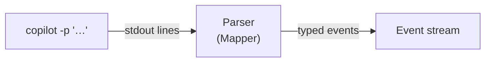

- **Transport**: Raw line-based stdout (Erlang Port with `:line` mode)
- **Lifecycle**: Single prompt, fire-and-forget
- **Capabilities**: Text output only—no thinking, no tool visibility, no usage data
- **When to use**: Quick scripts, CI pipelines, anything that just needs a text answer

### 2. ACP Mode — `copilot --acp --stdio`

The Agent Client Protocol is a standardized JSON-RPC 2.0 protocol for
communicating with coding agents. The Copilot CLI implements it as an ACP server.

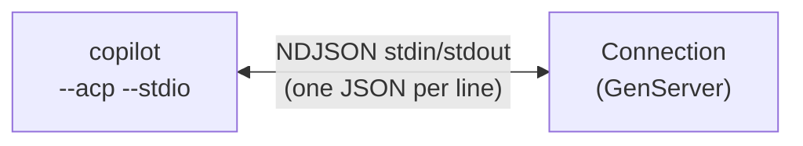

- **Transport**: Newline-delimited JSON (NDJSON) over stdin/stdout
- **Method naming**: Slash-separated — `session/new`, `session/prompt`
- **Lifecycle**: Long-lived subprocess, multiple sessions, multi-turn
- **Capabilities**: Thinking streams, tool calls, session resume, structured plans
- **Key trait**: `session/prompt` is **blocking** — the RPC response arrives only when the turn completes

### 3. CLI Server Mode — `copilot --server --stdio`

This is the protocol used by VS Code's Copilot Chat panel. It's the richest
of the three but uses a different framing and event model.

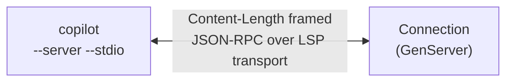

- **Transport**: LSP-style `Content-Length` framing (like the Language Server Protocol)
- **Method naming**: Dot-separated — `session.create`, `session.send`
- **Lifecycle**: Long-lived subprocess, multiple sessions, multi-turn
- **Capabilities**: Everything ACP has, plus token usage, cost tracking, quota data
- **Key trait**: `session.send` is **non-blocking** — it returns a `messageId` immediately; completion is signaled by a `session.idle` event

## Protocol Comparison

| Property | ACP (`--acp --stdio`) | CLI Server (`--server --stdio`) |
|---|---|---|
| Transport framing | NDJSON (newline-delimited) | `Content-Length: N\r\n\r\n{json}` |
| Method names | `session/new`, `session/prompt` | `session.create`, `session.send` |
| Init handshake | `initialize` (protocol version, capabilities) | `ping` (liveness check) |
| Event delivery | Curated `session/update` (~8 types) | Raw `session.event` (27+ types) |
| Prompt lifecycle | Blocking (response = turn complete) | Fire-and-forget + `session.idle` |
| Token usage | ❌ Not available | ✅ `assistant.usage` events |
| Cost/quota data | ❌ | ✅ Premium multiplier, quota snapshots |
| Permission model | Bidirectional (server asks, client responds) | Bidirectional (`permission.request` + `permission.requested` events) |
| Session management | `session/new`, `session/load` | `session.create`, `session.resume`, `session.destroy`, `session.list` |
| Hidden flag | No (`--acp` is in `--help`) | Yes (hidden via `hideHelp()` in Commander.js) |

## Transport Layer Details

### NDJSON (ACP)

Each message is a single line of JSON followed by `\n`. Parsing is trivial:
read a line, decode JSON.

```
→ {"jsonrpc":"2.0","id":1,"method":"initialize","params":{...}}\n
← {"jsonrpc":"2.0","id":1,"result":{...}}\n
← {"jsonrpc":"2.0","method":"session/update","params":{...}}\n
```

In Erlang/Elixir, open the Port with `{:line, 1_048_576}` to get line-buffered
reads. The Port delivers `{port, {:data, {:eol, line}}}` messages for each
complete line and `{:noeol, chunk}` for partial lines (which you buffer and
reassemble).

### Content-Length Framing (CLI Server)

Messages are framed with HTTP-style headers, identical to the Language Server
Protocol transport:

```
Content-Length: 142\r\n
\r\n
{"jsonrpc":"2.0","id":1,"method":"session.create","params":{...}}
```

Open the Port with `:stream` mode (raw binary) and parse frames yourself:

1. Find `\r\n\r\n` to locate the header/body boundary
2. Parse `Content-Length: N` from the headers
3. Read exactly `N` bytes of body
4. Decode JSON from the body
5. Repeat for the remaining buffer

When **sending**, construct the frame manually:

```
Content-Length: #{byte_size(json)}\r\n\r\n#{json}
```

No trailing newline required—the `Content-Length` tells the receiver exactly
how many bytes to read.

## ACP Protocol: Message Flow

### Initialization

Every ACP connection begins with a capability handshake:

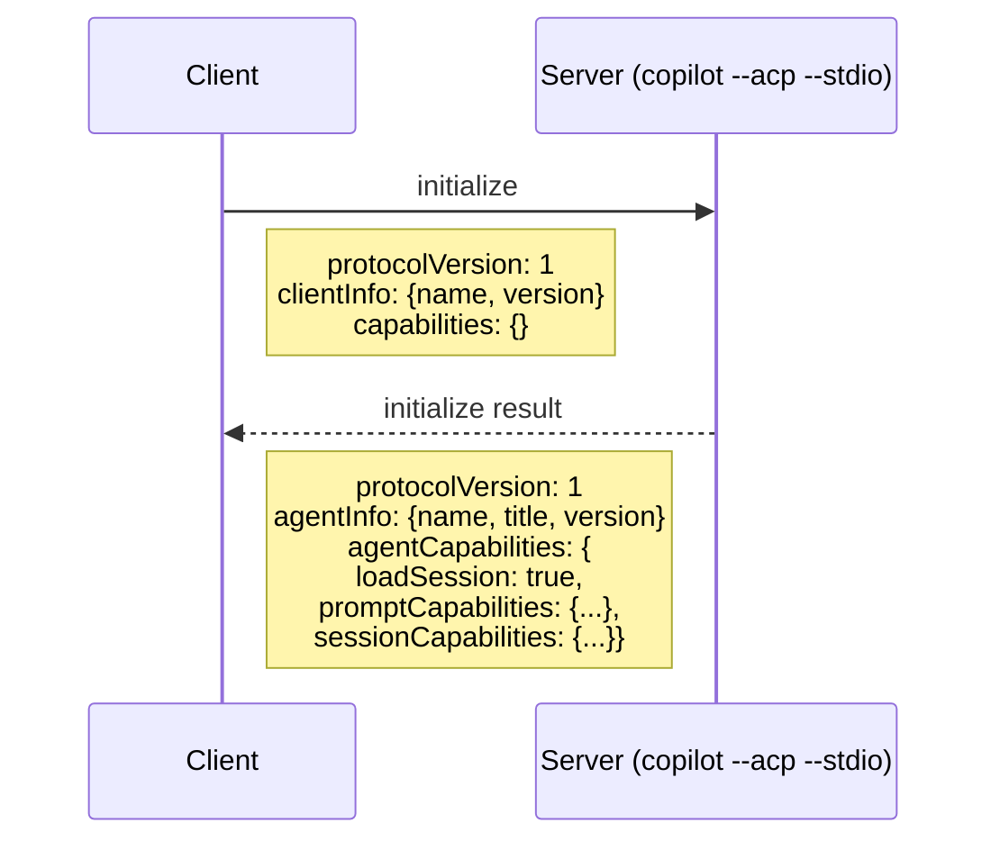

The `agentCapabilities` tell you what the server supports. `loadSession: true`
means you can resume previous sessions.

### Session Lifecycle

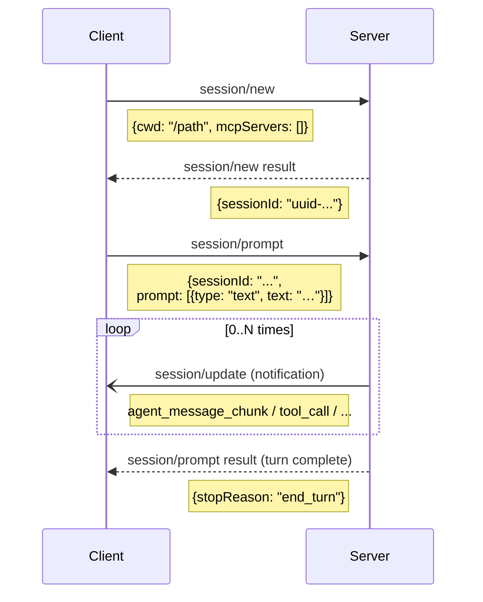

**Key insight**: `session/prompt` is a **blocking RPC call**. The response only
arrives when the entire turn is done (all tool calls executed, model finished
generating). During the turn, you receive `session/update` notifications
with streaming content.

### Session Update Types

The `session/update` notification carries a `sessionUpdate` field that indicates
the update type:

| `sessionUpdate` value | Description | `data` shape |
|---|---|---|
| `agent_message_chunk` | Streaming text from the model | `{type: "text", text: "..."}` |
| `agent_thought_chunk` | Thinking/reasoning content | `{type: "text", text: "..."}` |
| `tool_call` | Tool invocation started | `{toolCallId, title, kind, status}` |
| `tool_call_update` | Tool status change | Same shape, updated `status` |
| `plan` | Structured plan | `{entries: [{content, priority, status}]}` |
| `user_message_chunk` | Replayed user message (session/load) | `{type: "text", text: "..."}` |

### Permission Handling

When the model wants to call a tool that requires permission, the server sends
a **JSON-RPC request** (not notification) back to the client:

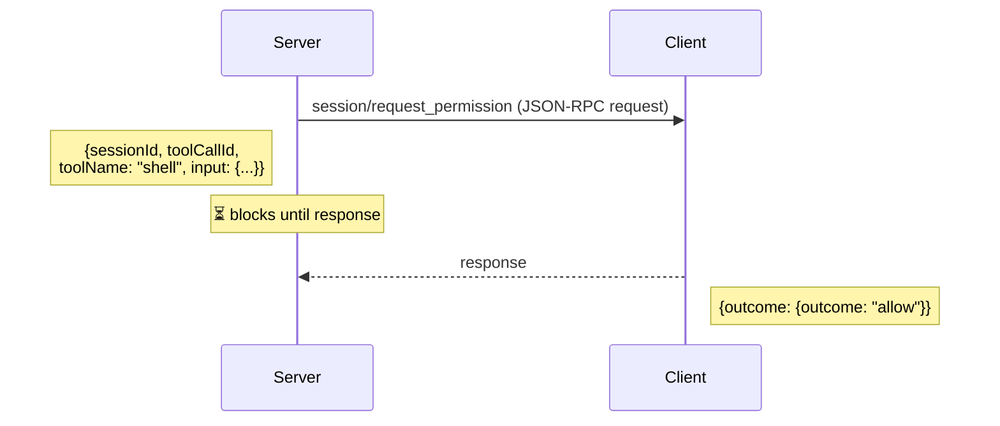

The `outcome` must be `"allow"`, `"deny"`, or `"cancelled"`. The server blocks
until it receives the response—this is what makes interactive approval UIs
possible.

In our implementation, we auto-approve everything:

```elixir
defp handle_agent_request(request, state) do
  if request.method == "session/request_permission" do
    response = Protocol.permission_response(request.id, :allow)
    send_to_port(state, response)
  end
  state
end
```

## CLI Server Protocol: Message Flow

### Initialization

The Server protocol uses a simpler liveness check instead of a capability
handshake:

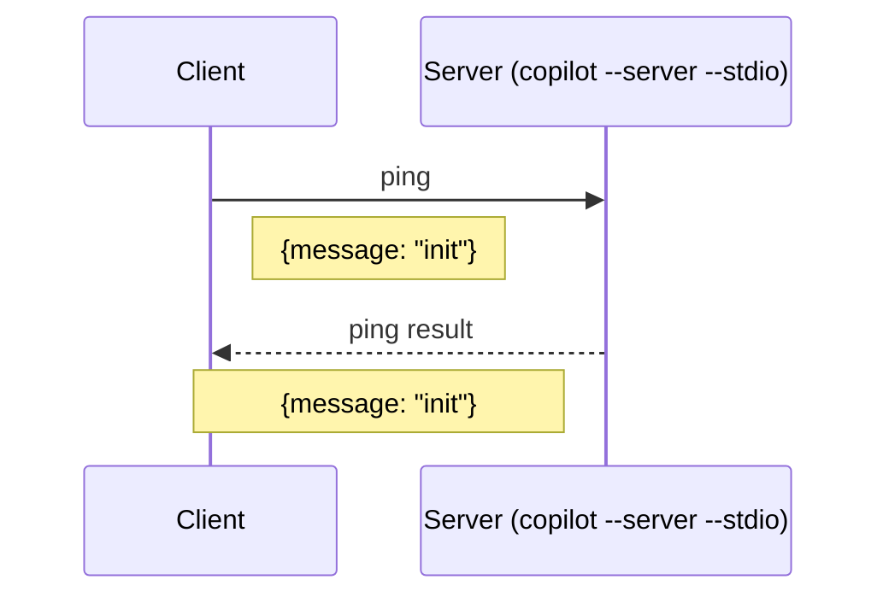

### Session Lifecycle

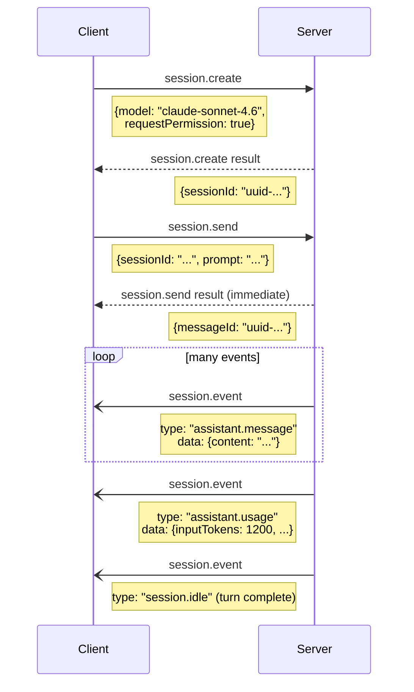

**Key insight**: `session.send` returns **immediately** with a `messageId`. The
turn runs asynchronously. You detect completion by watching for a `session.idle`
event. This is fundamentally different from ACP's blocking `session/prompt`.

### The 27+ Event Types

The Server protocol forwards **every** internal session event via `session.event`
notifications. The event `type` field identifies the category:

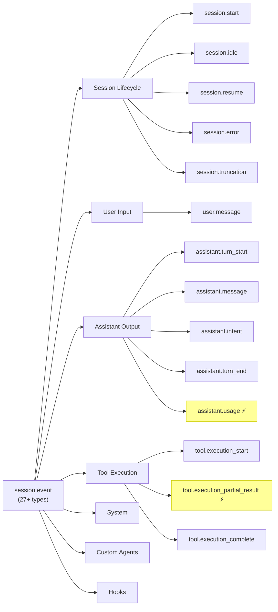

*⚡ = ephemeral (not persisted, not replayed on resume)*

**Session lifecycle**: `session.start`, `session.idle`, `session.resume`,
`session.error`, `session.info`, `session.truncation`, `session.handoff`,
`session.model_change`

**User input**: `user.message`

**Assistant output**: `assistant.turn_start`, `assistant.message`,
`assistant.intent`, `assistant.turn_end`, `assistant.usage` (ephemeral)

**Tool execution**: `tool.execution_start`, `tool.execution_partial_result`
(ephemeral), `tool.execution_complete`, `tool.user_requested`

**System**: `system.message`, `abort`

**Custom agents**: `custom_agent.selected`, `custom_agent.started`,
`custom_agent.completed`, `custom_agent.failed`

**Hooks**: `hook.start`, `hook.end`

Ephemeral events (marked with `ephemeral: true`) are only delivered during the
live session—they are **not** persisted and not replayed on session resume.

### The `assistant.usage` Event

This is the primary reason to choose the Server protocol over ACP. Each model
API call emits a usage event with detailed metrics:

```json
{
  "type": "assistant.usage",
  "ephemeral": true,
  "data": {
    "model": "claude-sonnet-4.6",
    "inputTokens": 12540,
    "outputTokens": 892,
    "cacheReadTokens": 8200,
    "cacheWriteTokens": 4340,
    "cost": 1,
    "duration": 3420,
    "initiator": "user",
    "quotaSnapshots": {
      "copilot_premium": {
        "used": 42,
        "limit": 300,
        "resetsAt": "2025-03-01T00:00:00Z"
      }
    }
  }
}
```

The `cost` field is the Premium Request multiplier—`1` for standard models like
Sonnet, `3` for Opus, `0.33` for Haiku.

### Permission Handling in Server Mode

In versions ≥0.0.421, the Server protocol supports bidirectional permission
handling when you set `requestPermission: true` in `session.create`. The CLI
uses **two paths** — both must be handled:

**Path 1: JSON-RPC request** (`permission.request`)

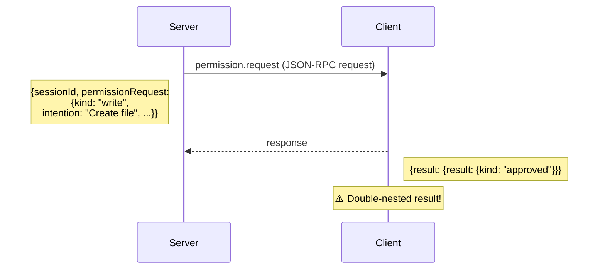

Note the double-nested `result`—the CLI's `dispatchPermissionRequest` does
`(await sendRequest(...)).result`, so the actual outcome must be nested inside
a `result` key.

**Path 2: Session event** (`permission.requested`)

The CLI may also emit a `permission.requested` event via `session.event`
notification. This requires responding via a separate RPC method:

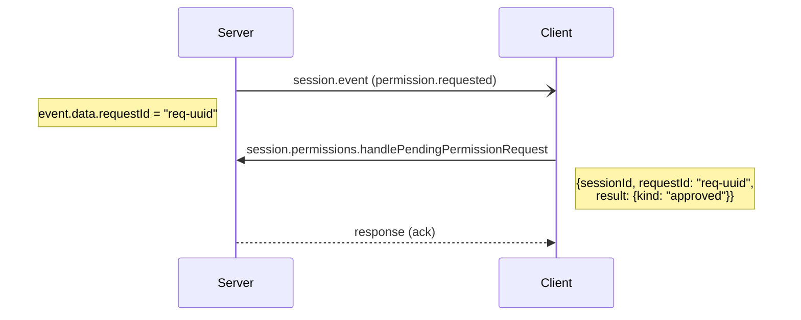

### External Tool Calls

The Server protocol supports external tools — custom tools registered by the
client that the LLM can invoke (e.g., `ask_user` for prompting the human).

Register tools in `session.create` via the `tools` parameter, then handle
`tool.call` JSON-RPC requests from the server:

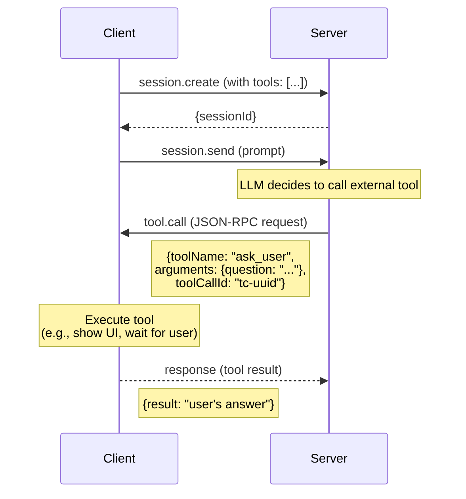

Alternatively, respond via `session.tools.handlePendingToolCall` RPC for
asynchronous tool execution (preferred for interactive tools).

### Additional Server-Only Methods

The Server protocol exposes session management methods not available in ACP:

| Method | Description |
|---|---|
| `session.create` | Create a session (with model selection) |
| `session.send` | Send a prompt |
| `session.resume` | Resume a previous session |
| `session.destroy` | Tear down a session (frees memory) |
| `session.list` | List all sessions with metadata |
| `session.getMessages` | Get all non-ephemeral events for a session |
| `session.getLastId` | Get the last session ID |
| `session.delete` | Delete a session from disk |
| `ping` | Liveness check |

## Implementation Architecture

Here's how we structured the Elixir implementation. The same pattern works in
any language with subprocess management.

### Connection GenServer

Both protocols are managed by a GenServer that owns the subprocess Port:

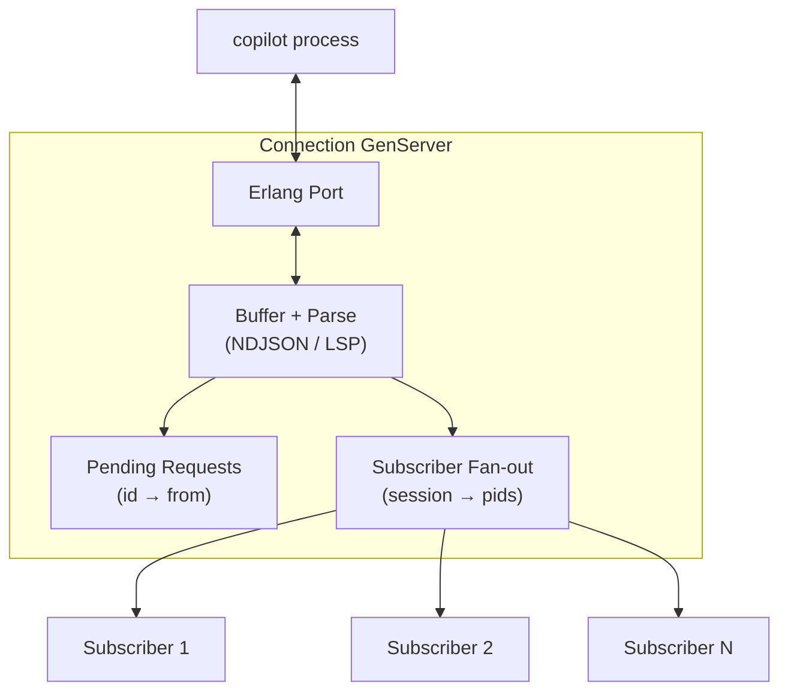

**Pending requests**: A map from JSON-RPC request `id` to `{request_type, caller}`.
When a response arrives, we look up the caller and `GenServer.reply/2`.

**Subscriber fan-out**: A map from `session_id` to a list of subscriber pids.
When a notification arrives (either `session/update` or `session.event`), we
send a message to all subscribers for that session.

The key difference is the buffer parsing:

- **ACP**: Line-buffered (`{:line, 1_048_576}`). The Port delivers complete
  lines. Buffer partial `{:noeol, chunk}` data and prepend to the next `{:eol, line}`.

- **Server**: Stream-buffered (`:stream`). Accumulate raw bytes, then
  loop to extract complete `Content-Length` frames:

```elixir
defp process_lsp_buffer(state) do
  case extract_lsp_message(state.buffer) do
    {:ok, json, rest} ->
      state = %{state | buffer: rest}
      state = handle_json_message(json, state)
      process_lsp_buffer(state)  # recurse for multiple messages in one chunk

    :incomplete ->
      state
  end
end

defp extract_lsp_message(buffer) do
  case :binary.match(buffer, "\r\n\r\n") do
    {header_end, 4} ->
      headers = :binary.part(buffer, 0, header_end)
      case parse_content_length(headers) do
        {:ok, content_length} ->
          body_start = header_end + 4
          total_needed = body_start + content_length
          if byte_size(buffer) >= total_needed do
            json = :binary.part(buffer, body_start, content_length)
            rest = :binary.part(buffer, total_needed, byte_size(buffer) - total_needed)
            {:ok, json, rest}
          else
            :incomplete
          end
        :error ->
          :incomplete
      end
    :nomatch ->
      :incomplete
  end
end
```

### Request ID Management

Both protocols use monotonically increasing integer IDs for request/response
correlation:

```elixir
defstruct [
  next_id: 1,
  pending_requests: %{},
  # ...
]

defp next_id(state) do
  {state.next_id, %{state | next_id: state.next_id + 1}}
end
```

When sending a request, allocate an ID, store the caller reference in
`pending_requests`, and match it when the response arrives:

```elixir
def handle_call({:create_session, opts}, from, state) do
  {id, state} = next_id(state)
  request = Protocol.create_session_request(id, opts)
  send_to_port(state, request)
  state = put_in(state.pending_requests[id], {:create_session, from})
  {:noreply, state}
end
```

### Turn Completion Detection

This is where the two protocols diverge most:

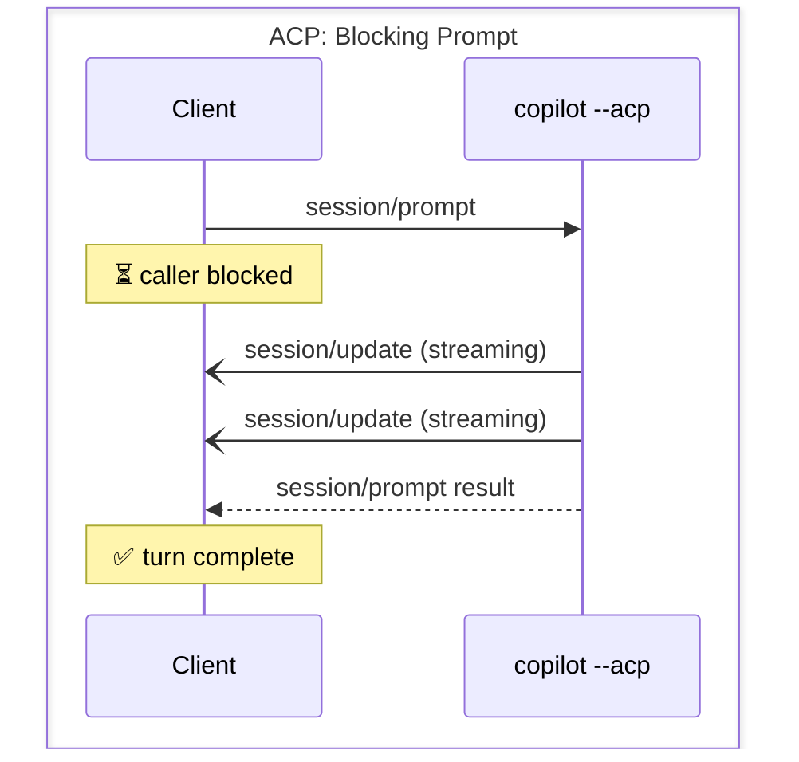

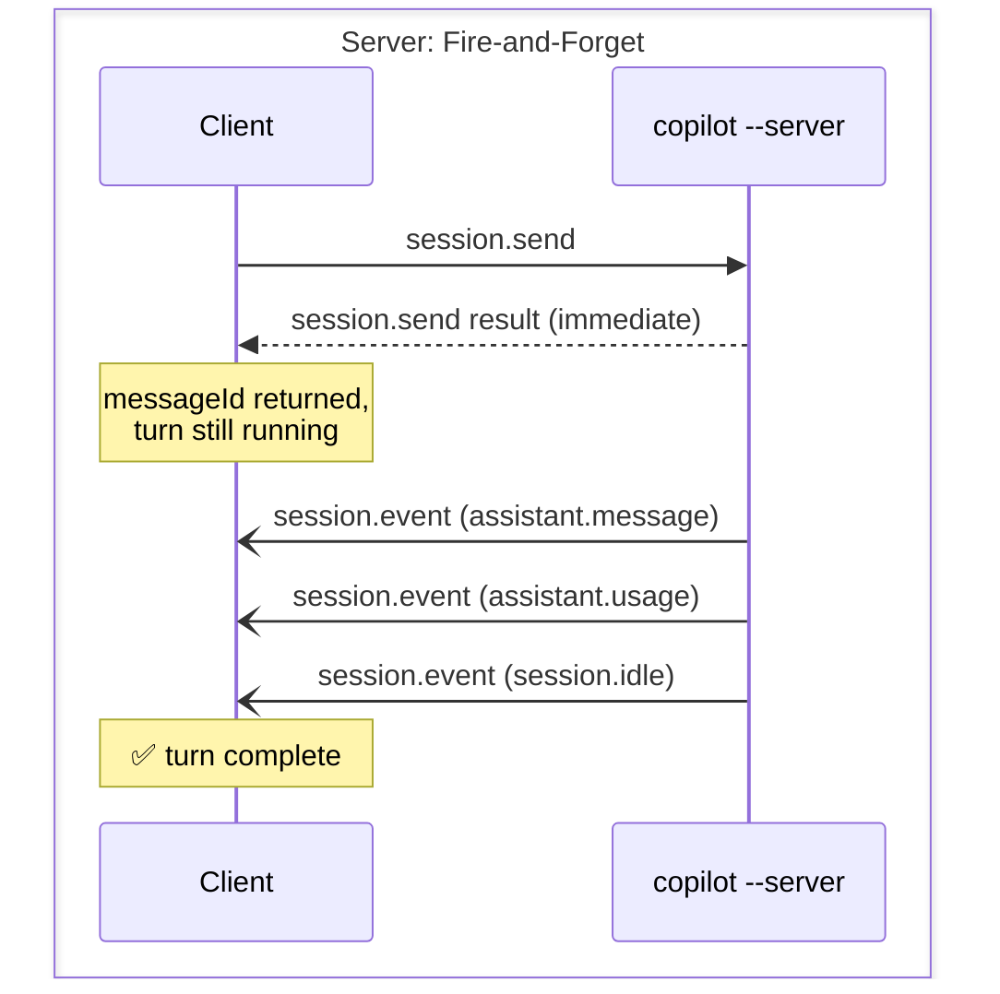

**ACP**: The `session/prompt` RPC call blocks. When you get the response, the
turn is done. Your GenServer caller is suspended (via `GenServer.reply/2`
deferred pattern) until the response arrives.

**Server**: The `session.send` RPC returns immediately with a `messageId`.
You need a separate mechanism to detect when the turn is actually complete.
We use a `StreamRunner` process that subscribes to session events and waits
for `session.idle`:

```elixir
defp do_forward_loop(agent_pid, session_id, deadline) do
  receive do
    {:server_event, %SessionEvent{session_id: ^session_id} = event} ->
      dispatch_event(agent_pid, session_id, event)
      if event.type == "session.idle" do
        :idle  # turn complete
      else
        do_forward_loop(agent_pid, session_id, deadline)
      end
  after
    wait_ms -> do_forward_loop(agent_pid, session_id, deadline)
  end
end
```

## Choosing Between ACP and Server

| If you need… | Use |
|---|---|
| Simple one-shot prompts | Port mode (`-p`) |
| Multi-turn with blocking calls | ACP (`--acp --stdio`) |
| Token usage and cost tracking | Server (`--server --stdio`) |
| Interactive permission prompts | ACP (native) or Server (with `requestPermission: true`) |
| External tool calls (ask_user) | Server (`tool.call` + `session.tools.handlePendingToolCall`) |
| Session management (list, delete) | Server |
| Easiest to implement | ACP (NDJSON is simpler than Content-Length framing) |
| Richest event stream | Server (27+ event types vs ~8) |
| Building a terminal UI | Server (you want usage data and fine-grained events) |

For most harness implementations, we recommend starting with **ACP** for
simplicity, then moving to **Server** when you need usage tracking or richer
events.

## Gotchas and Lessons Learned

### 1. The CLI must be authenticated

The `copilot` binary requires a valid GitHub authentication token. Run
`copilot auth login` interactively first. There is no programmatic auth flow.

### 2. Model selection timing

In ACP mode, the model is selected via CLI args (`--model claude-opus-4.6`)
at subprocess spawn time. You cannot change models mid-session.

In Server mode, the model is specified in `session.create`. We built a Node.js
wrapper script (`priv/copilot_wrapper/index.js`) that adds a `session.setModel`
RPC method—it works by appending a `session.model_change` event to the
session's `events.jsonl` file, destroying the in-memory session, and resuming
it. The CLI's session state machine picks up the new model on reload.

### 3. Buffering matters

ACP's NDJSON can produce very long lines (a single JSON object with base64-encoded
file contents can exceed 1MB). Set your line buffer high: `{:line, 1_048_576}`.

Server mode's Content-Length framing naturally handles large messages, but you
must handle the case where a single Port data callback contains multiple
complete messages (the `process_lsp_buffer` recursion above).

### 4. Subscriber lifecycle

Monitor your subscriber processes and clean up when they die:

```elixir
def handle_call({:subscribe, session_id, pid}, _from, state) do
  Process.monitor(pid)
  subs = Map.update(state.subscribers, session_id, [pid], &[pid | &1])
  {:reply, :ok, %{state | subscribers: subs}}
end

def handle_info({:DOWN, _ref, :process, pid, _reason}, state) do
  subs = Map.new(state.subscribers, fn {sid, pids} ->
    {sid, List.delete(pids, pid)}
  end)
  {:noreply, %{state | subscribers: subs}}
end
```

### 5. Permission response nesting

The Server protocol's `permission.request` response requires double-nesting:
`%{"result" => %{"kind" => "approved"}}`. The outer `result` is the JSON-RPC
result field; the inner `result` key exists because the CLI's internal code does
`(await sendRequest(...)).result` to unwrap one level. Get this wrong and
permissions silently fail.

### 6. Ephemeral events vanish on resume

`assistant.usage` and `tool.execution_partial_result` are ephemeral—they are
not stored in the session's `events.jsonl` and are not replayed on
`session.resume`. If you need a cost audit trail, persist these events yourself
during the live session.

### 7. Subprocess exit handling

Always handle the Port exit status and reply to all pending callers with errors:

```elixir
def handle_info({port, {:exit_status, status}}, %{port: port} = state) do
  Enum.each(state.pending_requests, fn
    {_id, {:send, from, _sid}} -> GenServer.reply(from, {:error, :connection_closed})
    {_id, {:create_session, from}} -> GenServer.reply(from, {:error, :connection_closed})
    _ -> :ok
  end)
  {:stop, {:subprocess_exit, status}, %{state | port: nil, pending_requests: %{}}}
end
```

Without this, callers hang forever when the subprocess crashes.

## Minimal Reimplementation Checklist

To build your own harness for either protocol:

1. **Spawn the subprocess** with the right flags (`--acp --stdio` or `--server --stdio`)
2. **Implement the transport layer** (NDJSON line parsing or Content-Length frame extraction)
3. **Send the init handshake** (`initialize` for ACP, `ping` for Server)
4. **Manage request IDs** — monotonic counter, map of `id → callback`
5. **Route notifications** — parse `session/update` (ACP) or `session.event` (Server) and fan out to subscribers
6. **Handle server→client requests** — `session/request_permission` (ACP) or `permission.request` + `tool.call` (Server)
7. **Handle external tools** (Server) — respond to `tool.call` requests via direct response or `session.tools.handlePendingToolCall`
8. **Detect turn completion** — wait for RPC response (ACP) or `session.idle` event (Server)
9. **Clean up on subprocess exit** — fail all pending requests, notify subscribers

The JSON-RPC 2.0 envelope is identical in both protocols:

```json
// Request (client → server)
{"jsonrpc": "2.0", "id": 1, "method": "...", "params": {...}}

// Response (server → client)
{"jsonrpc": "2.0", "id": 1, "result": {...}}
// or
{"jsonrpc": "2.0", "id": 1, "error": {"code": -1, "message": "..."}}

// Notification (server → client, no response expected)
{"jsonrpc": "2.0", "method": "...", "params": {...}}

// Server request (server → client, response required)
{"jsonrpc": "2.0", "id": 42, "method": "...", "params": {...}}
```

The only difference is how this JSON is framed on the wire.

## Source Code

The full implementation is at
[github.com/agentjido/jido_ghcopilot](https://github.com/agentjido/jido_ghcopilot).
Key files:

| File | Role |
|---|---|
| `lib/jido_ghcopilot/acp/connection.ex` | ACP GenServer (NDJSON transport) |
| `lib/jido_ghcopilot/acp/protocol.ex` | ACP JSON-RPC encode/decode |
| `lib/jido_ghcopilot/acp/types.ex` | ACP type definitions |
| `lib/jido_ghcopilot/server/connection.ex` | Server GenServer (LSP framing) |
| `lib/jido_ghcopilot/server/protocol.ex` | Server JSON-RPC encode/decode |
| `lib/jido_ghcopilot/server/types.ex` | Server type definitions (27+ events) |
| `lib/jido_ghcopilot/server/stream_runner.ex` | Server event→signal bridge |
| `lib/jido_ghcopilot/executor/acp.ex` | ACP executor (session lifecycle) |
| `lib/jido_ghcopilot/executor/server.ex` | Server executor (session lifecycle) |
| `priv/copilot_wrapper/index.js` | Node.js proxy for `session.setModel` |
